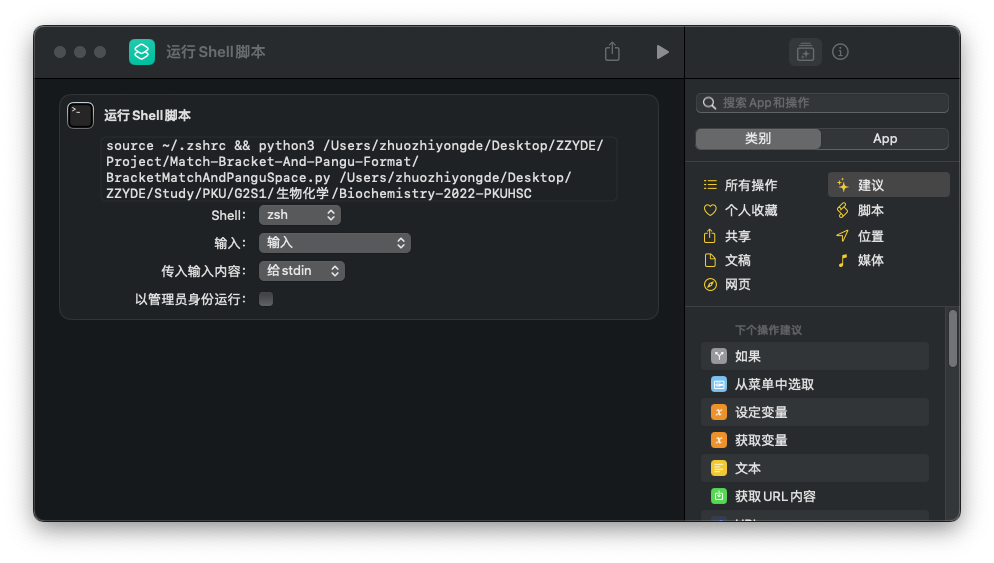

# Match-Bracket-And-Pangu-Format

A little tool to check markdown file's bracket match and use `Pangu.js` to add space, which makes your markdown more elegently.

一个小工具，检查 Markdown 文件的括号匹配，并使用 `Pangu.js` 添加空格，让您的 Markdown 更优雅。

## Feature

### Match Bracket

1. 忽略代码块和 LaTeX 公式块（包括行内代码和行内LaTeX公式）内的内容。
2. 忽略中英文差别，逐行检查括号是否匹配，如果不匹配，提示。
3. 如果括号匹配，按照左括号的类型对应调整右括号的语言类型。
4. 检查所有英文左括号，如果有其左右任一为中文字符，则将其与其配对的括号替换为中文括号。


### Pangu Format

1. 忽略代码块和 LaTeX 公式块（包括行内代码和行内LaTeX公式）内的内容。
2. 使用 `Pangu.js` 来对文件格式化。
3. 忽略可以被正则表达式 `r'( [Why doesn't .bashrc run automatically?](https://apple.stackexchange.com/questions/12993/why-doesnt-bashrc-run-automatically)

按照自定义导出，调整命令为

```bash
python3 ~/path/to/BracketMatchAndPanguSpace.py ${currentPath}
```

或者

```bash
python3 ~/path/to/BracketMatchAndPanguSpace.py ${currentFolder}
```


当然，你可以在去 `系统设置 - 键盘 - 键盘快捷键 - App 快捷键` 内为这个命令设定快捷键。


### For Shortcuts

如果你不希望有输出，你可以使用 `快捷指令` 来通过 shell 运行此脚本。

以下是一个例子：

```bash
source ~/.zshrc && python3 /path/to/BracketMatchAndPanguSpace.py /targetPath
```




